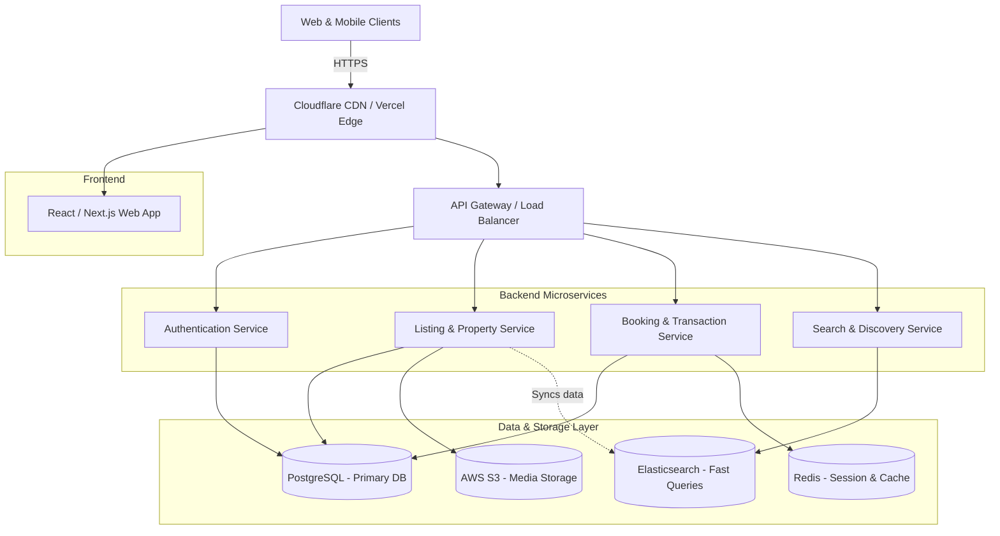

# Production-Scale Airbnb Architecture

This architecture diagram illustrates the high-level scaling strategy for a production-level vacation-rental marketplace, handling global traffic, search optimization, and robust media storage.

**Live Vercel Deployment:** https://airbnb-clone-x.vercel.app/

## System Architecture Diagram

## Component Breakdown

### 1. Frontend & Deployment
- **Tech Stack:** React (Vite/Next.js) for high-performance UI rendering.
- **Scaling:** Deployed on Vercel's Edge Network, utilizing a global CDN to serve static assets instantly with sub-second latency worldwide.

### 2. Backend Microservices
- **Authentication:** Handles JWT-based user login and secure sessions.
- **Property & Booking:** Dedicated Node.js/Go services to independently scale high-read operations (viewing listings) versus high-consistency write operations (reserving dates).
- **Search & Discovery:** A dedicated service querying Elasticsearch to support complex geographic searches, date filtering, and price range sorting in milliseconds.

### 3. Data & Storage
- **PostgreSQL:** The primary relational database ensuring ACID compliance for critical booking transactions and user data.
- **Redis:** Provides high-speed caching for frequently accessed listings and manages temporary user session states.
- **Elasticsearch:** Dedicated search index optimized for geospatial and text-based property searches.
- **AWS S3:** Scalable object storage for hosting thousands of high-resolution property images, integrated with a CDN for fast global delivery.
