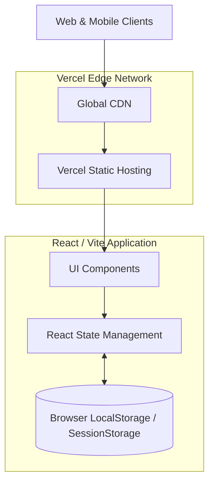

# High-Level Architecture Diagram
## Airbnb Clone (Frontend-Focused Deployment)

As per the implementation choice to keep the application simple and focused, this architecture illustrates a **Frontend-Only** strategy leveraging browser storage, deployed for global scale.

### Architecture Strategy:
1. **Frontend**: Built entirely in React using Vite for ultra-fast bundling.
2. **Deployment**: Deployed on Vercel's Edge Network. Vercel acts as a global CDN, serving the static assets instantly to users worldwide, ensuring high availability and low latency.
3. **Storage (Frontend)**: As permitted by the guidelines to keep the scope focused, all user session data (like saved properties or search history) is stored entirely in the browser's `LocalStorage`.
4. **Search**: Handled entirely on the client-side via JavaScript filtering over the localized JSON state, eliminating the need for a complex backend search engine.
