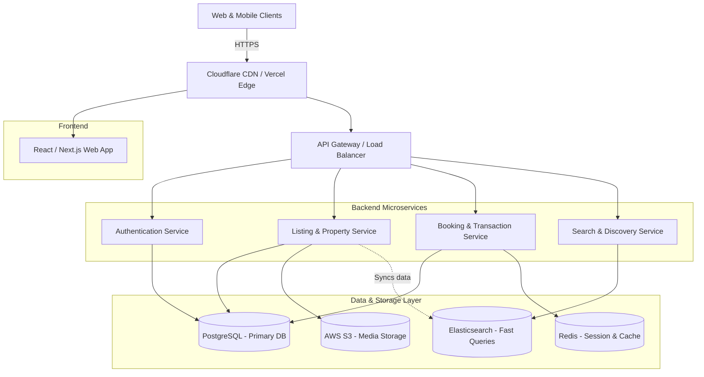

# Future Production-Scale Architecture

While the current implementation focuses on a pixel-perfect, frontend-only strategy to keep the codebase simple and focused (as per the guidelines), this document outlines the **future scaling strategy** required to transition this clone into a full production-scale vacation-rental marketplace (like Airbnb).

This ensures the architecture can handle global traffic, advanced search optimization, robust media storage, and consistent booking transactions.

## Full-Scale System Architecture Diagram

## Component Breakdown & Scaling Strategy

### 1. Frontend & Deployment
- **Tech Stack Expansion:** Transition from a pure Vite React SPA to Next.js for Server-Side Rendering (SSR) to improve SEO and initial load times for property listings.
- **Scaling:** Continue utilizing Vercel's Edge Network or AWS CloudFront to serve static assets instantly with sub-second latency worldwide.

### 2. Backend Microservices
- **Authentication Service:** Handles JWT-based user login, OAuth integrations, and secure sessions independently.
- **Property & Booking Services:** Dedicated Node.js/Go services to independently scale high-read operations (users constantly viewing listings) versus high-consistency write operations (locking in dates for a reservation).
- **Search & Discovery Service:** A dedicated service querying Elasticsearch to support complex geographic searches, date filtering, and dynamic price range sorting in milliseconds.

### 3. Data & Storage Layer
- **PostgreSQL:** The primary relational database ensuring ACID compliance for critical booking transactions, user profiles, and host financial data.
- **Redis:** Provides high-speed caching for frequently accessed listings, reducing the load on the primary database, and manages temporary user session states.
- **Elasticsearch:** A dedicated search index optimized specifically for geospatial (map-based) and text-based property searches, updated asynchronously from the main database.
- **AWS S3:** Scalable object storage for hosting thousands of high-resolution property images (for the Photo Tour and Lightbox), integrated directly with a CDN for fast global delivery.
